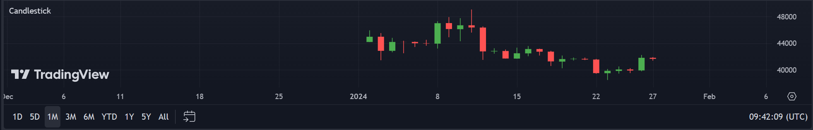

# Learn PineScript4

## Keyboard Shortcuts

- Ctrl + S: Save
- Mouse Hover: Pop up hovered reference manual
- Ctrl + Left Click: Pop up windowed reference manual
- Ctrl + /: Comment or Uncomment
- Ctrl + O: Open an existed Script
- Tab: Indentation
- Shift + Tab: Delete Indentation

## Documentation

[Pine Script 4 User Manual — Pine Script User Manual 4 documentation (tradingview.com)](https://www.tradingview.com/pine-script-docs/en/v4/index.html#)

## My First Scripts

### C01FirstScript

```js
//@version=4
study("My Script")
plot(close)

```

### C02RSI

```js
//@version=4
study(title="Relative Strength Index", shorttitle="RSI", format=format.price, precision=2, resolution="")
len = input(14, minval=1, title="Length")
src = input(close, "Source", type = input.source)
up = rma(max(change(src), 0), len)
down = rma(-min(change(src), 0), len)
rsi = down == 0 ? 100 : up == 0 ? 0 : 100 - (100 / (1 + up / down))
plot(rsi, "RSI", color=#8E1599)
band1 = hline(70, "Upper Band", color=#C0C0C0)
band0 = hline(30, "Lower Band", color=#C0C0C0)
fill(band1, band0, color=#9915FF, transp=90, title="Background")

```

## Syntax Overview

- First line: `//@version=4` to determine version, otherwise default to version 1.

  Note that: Pine Script Language versions are incompatible with each other.

- Second line: A study or strategy annotation call.

  e. g. `study(title="RSI")`

- (Study only) Last line: plot something.

  e. g. `plot(rsi, color=color.purple)`

- (Strategy only) Must contains strategy calls.

  e. g. `strategy.enrty()`

## Study vs Strategy

- Study: for **providing timing alerts**, can create and use `alertcondition`, cannot contain `startegy.***()` call.
- Strategy: used to **run backtests**, can create and use `startegy.***()` call, cannot use `alertcondition`.

## Lines & Indentations

- Multi-line: >= 1 space to connect each other, but not a multiple of 4

  e. g. This line will work:

  ```js
  study(title="Relative Strength Index",
   shorttitle="RSI",
    format=format.price,
         precision=2,
                                   resolution="")
  ```

- A multiple of 4 is used when defining custom functions.

## Variable Types

- Integer
- Float
- String
- Bool
- Color (#fff000, color.yellow)
- Line and Label
- Plot and hline
- na (not available, just like null or None)

## String Escaping

- Single quote inside double quotes will be automatically escaped.
- Double quote inside single quotes will be automatically escaped.
- Single quote inside single quotes **WILL NOT** be automatically escaped.
- Double quote inside double quotes **WILL NOT** be automatically escaped.
- Use backslash `\` to escape

## Mutability

PineScript variables are all immutable, once defined, it won't be able to change.

> In Pine Script, once a variable is defined, you cannot redefine it. However, you can create a new variable with a different name and assign it the value you want. If you need to update the value of a variable, you should use a different variable name. 

```js
a = 100
// a = 2  // re-definition not gonna work, immutable.
a := 2    // use := to forcely re-define.
```

## Boolean

```js
a = false
b = true
```

## Data Window


## Tuple

```js
// Tuples
f_get_highlow() => [high, low]
[hi, lo] = f_get_highlow()
```

## Plot: Drawing a line

```js
plot(close, color=color.red)
plot(open, color=color.green)
plot(high, color=color.blue)
plot(low, color=color.aqua)
```


## Fill: Fill color between two Plot

```js
// Fill Example 1
hi_plot = plot(high, color=color.red)   // know as hline object
lo_plot = plot(low, color=color.green)  // know as hline object
fill(hi_plot, lo_plot, color=color.aqua, transp=70)
```


```js
// Fill Example 2
rsi_high = plot(70, color=color.red)
rsi_low  = plot(30, color=color.green)
fill(rsi_high, rsi_low, color=color.aqua, transp=70)
```


```js
// Fill Example 3
fill_high = plot(37000, color=color.red)
fill_low  = plot(32000, color=color.green)
fill(fill_high, fill_low, color=color.aqua, transp=70)
plot(high)
```


```js
// Fill Example 4
fill_high = hline(37000)
fill_low  = hline(32000)
fill(fill_high, fill_low, color=color.aqua, transp=70)
plot(high)
```


Compare Example 3 & 4, we can see that:

- `plot` not only returns a hline object, but also drawing the line

- `hline` only returns a hline object

- What's more, if a code only contain `hline` and `fill`, it won't compile, but if `plot` and `fill`, it will.

  Lesson: A PineScript code should definitely include `plot` before it can be compiled.

Noticing that `plot` and `hline` can **both** handle **curve line** and **straight line**.

```js
// Fill Example 5
hi_plot = plot(high, color=color.red)   // know as hline object
lo_plot = plot(low, color=color.green)  // know as hline object
fill(hi_plot, lo_plot, color=color.aqua, transp=70)
fill_high = plot(37000, color=color.red)
fill_low  = plot(32000, color=color.green)
fill(fill_high, fill_low, color=color.aqua, transp=70)
```


## Bgcolor

```
bgcolor(color.green)
```


## na Type

When defining a na variable, you need to **specify what type** the identifier is, just like what C++ do. (Kinda Tricky)

```js
// variable = na  // not gonna work
color variable = na
int variable2 = na
float variable3 = na
```

## If Statement

```js
//@version=4
study("My Script")

op = plot(open, color=color.green)
cl = plot(close, color=color.red)
fill(op, cl, color=color.aqua)

color bg = na
if close > open
    bg := color.red
else
    bg := color.green
bgcolor(bg)

```


~~This demo further shows that:~~

- ~~`bg` is **not** just a **simple color variable** like other languages do.~~
- ~~`bg` is actually a **COMPLEX VARIABLE** storing **EVERY DAY'S SEPERATE COLOR**!~~

## Candlestick Chart

Rule (Image's color reverted, just like Chinese stock market, don't mind):

- Line top & bottom: high and low
- Bar top & bottom: open and close


Code:

### C06CandlestickChart (worse version)

```js
//@version=4
study("Candlestick Chart", shorttitle="Candlestick")

// Plotting candlesticks
plotCandle(openValue, highValue, lowValue, closeValue) =>
    // Check if it's a bullish candle
    if closeValue > openValue
        // Plot bullish candle
        line.new(x1=bar_index, y1=openValue, x2=bar_index, y2=closeValue, color=color.green, width=10)
        line.new(x1=bar_index, y1=lowValue, x2=bar_index, y2=highValue, color=color.green, width=1)
    // Check if it's a bearish candle
    else if closeValue < openValue
        // Plot bearish candle
        line.new(x1=bar_index, y1=openValue, x2=bar_index, y2=closeValue, color=color.red, width=10)
        line.new(x1=bar_index, y1=highValue, x2=bar_index, y2=lowValue, color=color.red, width=1)

// Call the function to plot candlesticks
plotCandle(open, high, low, close)

```



## C06CandlestickChart

```js
//@version=4
study("Candlestick Chart", shorttitle="Candlestick")

// Determine if the current bar is bullish or bearish
isBullish = close > open
isBearish = close < open

// Plot bullish candlesticks with green color and bearish candlesticks with red color
plotcandle(open, high, low, close, color = isBullish ? color.green : isBearish ? color.red : na)

```


This demo further shows that:

- `isBullish` is **NOT** a **COMPLEX VARIABLE** storing **EVERY DAY'S SEPERATE COLOR**
- `isBullish` is ACTUALLY **CREATED AND DESTROYED DAILY**, JUST A **LOCAL-DAY VARIABLE**!

